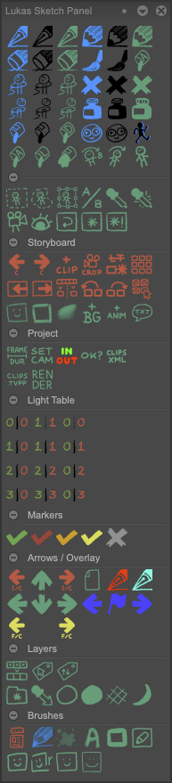

# Lukas Sketch Panel
A Custom Panel with a collection of tools and scripts for TVPaint.
> [!NOTE]
> There's a bunch of very useful buttons that will need explanation, but don't have any. Good luck!
## How to install
Download [Lukas_Sketch_Panel.tvpx](panels/Lukas_Sketch_Panel.tvpx?raw=1) and drag it into TVPaint.
> [!CAUTION]
> Some buttons might not work in older versions of TVPaint or non-Pro versions.
## Recommended shortcuts
Keyboard shortcut | Panel button
--- | ---
`Left` | Previous Frame (and Clip)
`Right` | Next Frame (and Clip)
`,` | Previous Instance (and Clip)
`.` | Next Instance (and Clip)
`<` | Add clip exposure
`>` | Remove clip exposure
`Up` | Move up a layer (skip locked layers)
`Down` | Move down a layer (skip locked layers)
`H`, `Shift H` | Toggle show/hide other layers
`Cmd L`, `Ctrl L` | 1-1
`` ` ``| Select Color Group Preset
`/`| Set In/Out to selection
`T`| Tintlasso (Normal)
`Y`| Eraselasso (Normal)
`P`, `Shift P`, `Ctrl P` | Rotate Brush by Increments

## Changelog

- [3.14]
  - Added `Clips to TVPaint Projects`.
- [2.14]
  - Reworked and simplified framerate buttons, created `Set  Project Frame Duration`.
  - Updated `Select Color Group Preset` and `Cycle Color Group` to set group for all selected layers.
- [2.13]
  - Fixed bug in `Remove Clip Exposure` when using it on clips with layers that start in the future.
- [2.12]
  - Updated `Render Clips With XML` to create 25 FPS XML files. (Currently hardcoded)
- [2.11]
  - Updated `Render Clips With XML` to support TVP Standard version.
  - Updated `Remove Clip Exposure` to actually be useful.
- [2.10]
  - New panel layout
  - Added dynamic font size to `Add Dialogue` (based on Consolas font).
  - Updated `Create Anim Layer` to create layer at current frame above selected layer.
  - Added option to overwrite last render with `Render Clips With XML`.
  - Updated `Eraser` to use improved presets.
  - Updated `Mark Selected Instances Color` to color layer instead, if layer is static.
- [2.9]
  - Reworked `Rotate Brush by Increments`
- [2.8]
  - Fixed bug in `Create color fill layer` where it would color more than just the current layer if the current layer was not the top layer.
  - Removed version number from Panel Identification string.
- [2.7]
  - Fixed bug in `Create color fill layer` where line layer name would get cut off after space character.
  - Added `Cycle Color Group`.
  - Renamed `Label` to `Select Color Group Preset` and changed icon.
  - Replaced dummy button by vertical separators.
- [2.6]
  - Added `Add/remove clip exposure`.
  - Added `Create BG layer`.
- [2.5]
  - `Create color fill layer` adds appropriate `_line` and `_color` postfixes to layers it uses.
  - Updated and translated `Toggle visibilty for line/color/detail/shading layers` to use English layer naming conventions.
- [2.4]
  - Fixed `Create color fill layer` for TVP11.
  - Changed `Toggle color layers` to use English layer naming conventions.
- [2.3]
  - Fixed `New static/animated layer` for TVP11.
  - Renamed `Up/Down` to `Move up/down a layer (skip locked layers)`.
- [2.2]
  - Changed light table buttons to toggle instead of just turning on.
- [2.1]
  - Fixed XML export.
- [2.0]
  - Release.
