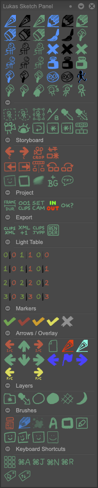

# Lukas Sketch Panel

Lukas Sketch Panel is a TVPaint panel.

## Tools
There's a bunch of tools and buttons that will need explanation, but don't have any. Good luck!

## Recommended shortcuts
Keyboard shortcut | Panel button
--- | ---
`Left` | *Previous Frame (and Clip)*
`Right` | *Next Frame (and Clip)*
`Up` | *Up*
`Down` | *Down*
`H` | *Toggle show/hide other layers*
`Shift H` | *Toggle show/hide other layers*
`Cmd L` | *1-1*
`` ` ``| *Label*

## Change Log
- [2.2]
  - Changed light table buttons to toggle instead of simply turning on/off
- [2.1]
  - Fixed XML export
- [2.0]
  - Release